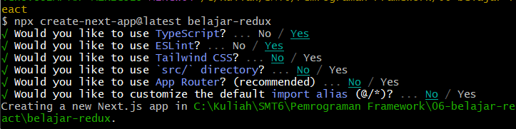
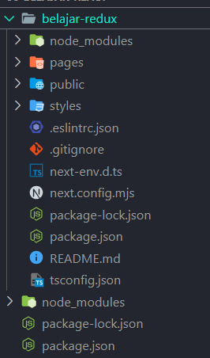
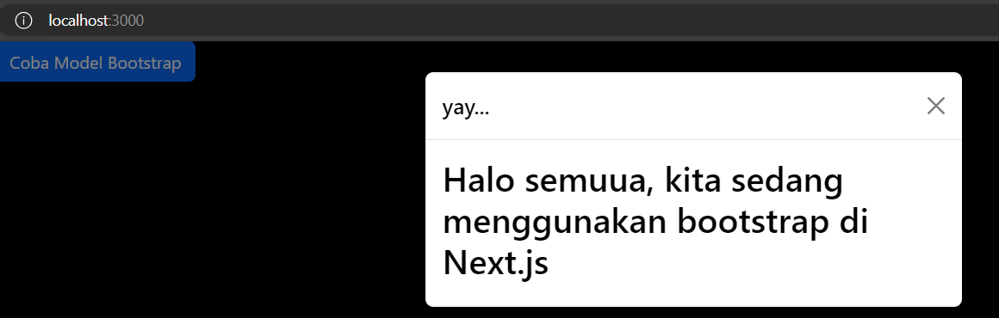
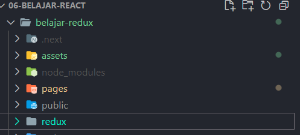
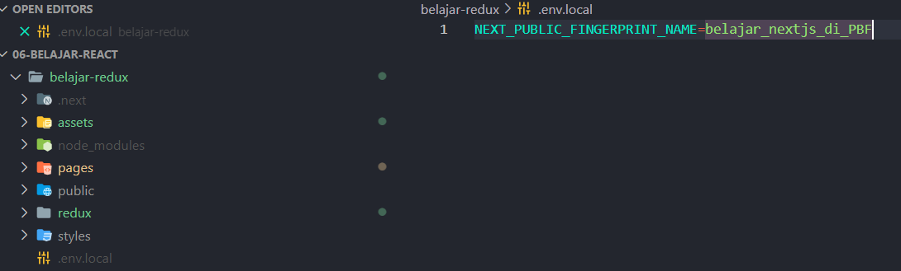
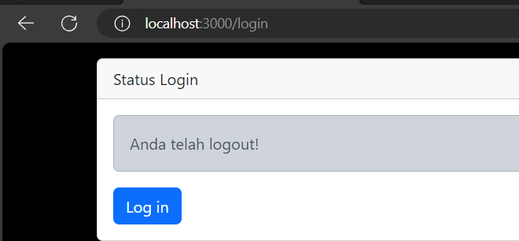
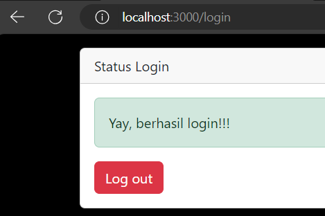
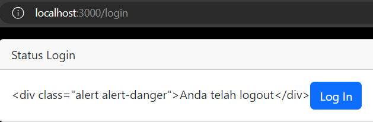
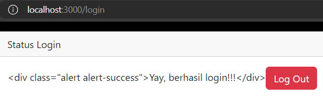
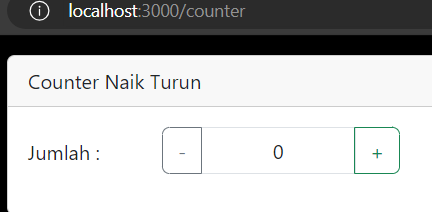

# 4. Praktikum 1: Instalasi Redux dan bootstrap



Kita buka open folder untuk project pertemuan-06 di VS Code, maka isi direktori yang ada di dalamnya sedikit berbeda dengan project yang sudah pernah kita buat sebelumnya. Yaitu terdapat folder pages dan styles.



Kali ini kita coba pakai CSS Library Bootstrap dengan menjalankan perintah

```javascript
npm install bootstrap
```

Kemudian kita import bootstrap pada aplikasi next.js kita. Kita edit file pages/_app.tsx

```javascript
import "bootstrap/dist/bootstrap.min.css";
import "@/styles/globals.css";
import type { useEffect } from "react";

function MyApp({ Component, pageProps }) {
  useEffect(() => {
    require("bootstrap/dist//js/bootstrap.bundle.min.js");
  }, []);
  return <Component {...pageProps} />;
}

export default MyApp;
```

Sekarang kita perlu mencoba implementasi bootstrap pada project next.js kita.

Contoh kita edit file pages/index.tsx menjadi seperti ini

```javascript
import Head from "next/head";
import Image from "next/image";
import { Inter } from "next/font/google";
import styles from "@/styles/Home.module.css";

const inter = Inter({ subsets: ["latin"] });

export default function Home() {
  return (
     <div className="container">
      <div className="row">
        <div className="col-12">
          <button type="button"
                  className="btn btn-primary"
                  data-bs-toggle="modal"
                  data-bs-target="#exampleModel">
                  Coba Model Bootstrap
          </button>
        </div>
      </div>
      <div className="modal fade"
           id="exampleModel"
           tabIndex="-1"
           aria-labelledby="exampleModelLabel"
           aria-hidden="true">
      <div className="modal-dialog">
        <div className="modal-content">
          <div className="modal-header">
            <h5 className="modal-title text-black" id="exampleModalLabel"> yay... </h5>
            <button
            type="button"
            className="btn-close"
            data-bs-dismiss="modal"
            aria-label="Close"></button>
          </div>
          <div className="modal-body text-black">
            <h2>Halo semuua, kita sedang menggunakan bootstrap di Next.js</h2>
          </div>
        </div>
      </div>
    </div>
  </div>
  );
}
```
Coba kita jalankan project next.js kita, dan laporkan apa yang terjadi?



5. Praktikum 2: Contoh Login dengan Redux
Komponen yang digunakan pada praktikum kali ini adalah redux-toolkit dan redux-persistent sehingga kita perlu menginstall-nya

```javascript
npm i --save redux-persist react-redux @reduxjs/toolkit
```

Selanjutnya kita install wrapper untuk redux di next.js

```javascript
npm i --save next-redux-wrapper
```

Selain itu, kita akan menggunakan html parser yang ada di react. Hal ini kita gunakan untuk memparsing html string menjadi sebuah html page

```javascript
npm install html-react-parser
```

Setelah berhasil menginstal kita cek di file package.json apakah library sudah ada

```javascript
"name": "belajar-redux",
  "version": "0.1.0",
  "lockfileVersion": 3,
  "requires": true,
  "packages": {
    "": {
      "name": "belajar-redux",
      "version": "0.1.0",
      "dependencies": {
        "@reduxjs/toolkit": "^2.2.2",
        "bootstrap": "^5.3.3",
        "html-react-parser": "^5.1.9",
        "next": "14.1.4",
        "next-redux-wrapper": "^8.1.0",
        "react": "^18",
        "react-dom": "^18",
        "react-redux": "^9.1.0",
        "redux-persist": "^6.0.0"
      },
      "devDependencies": {
        "@types/node": "^20",
        "@types/react": "^18",
        "@types/react-dom": "^18",
        "eslint": "^8",
        "eslint-config-next": "14.1.4",
```

Selanjutnya, kita buat folder dengan nama redux yang sejajar dengan folder public



Kemudian kita buat file redux/auth/authSlice.js seperti berikut



Selanjutnya, kita buat file baru di pages/login.tsx, dan kita tulis kode berikut

```javascript
import { useDispatch, useSelector } from 'react-redux';
import { setLogin } from '../redux/auth/authSlice';
import "bootstrap/dist/css/bootstrap.min.css";
import parse from 'html-react-parser';
import { RootState } from '@reduxjs/toolkit/query';


export default function LoginCheck() {
  const { isLogin } = useSelector((state : RootState) => state.auth);
  const dispatch = useDispatch();

  function handleAuth(type: string) {
    if (type === 'logout' || type === 'login') {
      dispatch(setLogin({ isLogin: type === 'login' ? true : false }));
    }
  }
  

  return (
    <div className="container">
      <div className="row">
        <div className="col-12">
          <div className="card mt-3">
            <div className="card-header">Status Login</div>
            <div className="card-body">
              {isLogin ? (
                // Jika berhasil login (isLogin = true)
                <>
                  <div className="alert alert-success">Yay, berhasil login!!!</div>
                  <button className="btn btn-md btn-danger" onClick={() => handleAuth('logout')}>Log out</button>
                </>
              ) : (
                // Jika telah logout (isLogin = false)
                <>
                  {parse('<div class="alert alert-dark">Anda telah logout!</div>')}
                  <button className="btn btn-md btn-primary" onClick={() => handleAuth('login')}>Log in</button>
                </>
              )}
            </div>
          </div>
        </div>
      </div>
    </div>
  );
}

```

Soal
1. Coba akses http://localhost:3000/login, dan klik tombol login. Kemudian lakukan refresh page berkali-kali (jika perlu restart npm run dev nya). Simpulkan apa yang terjadi ?

2. Baris 25 dan 30 terdapat method parse(), apa yang terjadi jika kita tidak menggunakan method tersebut

Jawaban : 




1. Setelah melakukan refresh page berkali-kali, maka akan tampil pesan "Yay, berhasil login !!!" dan jika logout maka akan tampil pesan "Anda telah logout". Hal ini terjadi karena menggunakan Redux untuk menyimpan data login dan logout sehingga data tersebut tidak akan hilang ketika melakukan refresh page atau restart npm run dev nya.




2. Jika tidak menggunakan method parse(), maka akan muncul tampilan mentahan dari div karena parse digunakan untuk mengubah string menjadi objek.

6. Praktikum 3: Membuat Aplikasi Counter Sederhana

Tampilan mungkin tidak semenarik pada gambar di atas, karena saat ini kita tidak fokus pada CSS-nya. Untuk membuat aplikasi tersebut, silakan lakukan langkah-langkah praktikum berikut.

Kita buat file di redux/counter/naikTurunSlice.js

```javascript
import { createSlice } from '@reduxjs/toolkit';

export const naikTurunSlice = createSlice({
    name: 'CounterNaikTurun',
    initialState: {
        totalCounter: 0 //counter yang menghitung naik/turun
    },
    reducers: {
        tambahCounter(state) {
            state.totalCounter += 1;
        },
        kuraCounter(state) {
            state.totalCounter -= 1;
        }
    },
});

export const { tambahCounter, kuraCounter } = naikTurunSlice.actions;
export default naikTurunSlice.reducer;
```

Setelah itu kita modifikasi redux/store/store.js untuk menambahkan Redux reducer pada store

```javascript
import { combineReducers, configureStore } from '@reduxjs/toolkit';
import authReducer from '../auth/authSlice';
import counterReducer from '../counter/naikTurunSlice';
import storage from 'redux-persist/lib/storage';
import { persistStore, persistReducer, FLUSH, REHYDRATE, PAUSE, PERSIST, PURGE, REGISTER } from 'redux-persist';

const persistConfig = {
   key: process.env.NEXT_PUBLIC_FINGERPRINT_NAME,   // simpan config di file .env.local
   storage,
   whitelist: ['auth'],
};

const rootReducer = combineReducers({
   auth: authReducer,
   counter: counterReducer,
});
```

Selanjutnya kita buat halaman untuk menampilkan counter.

Kita buat file baru di pages/counter.tsx

```javascript
import { useDispatch, useSelector } from "react-redux";
import { tambahCounter, kuraCounter } from "@/redux/counter/naikTurunSlice";

export default function CounterNaikTurun() {
    // kita pilih reducer counter yang telah di daftarkan pada store.js
    const {totalCounter} = useSelector((state) => state.counter);

    const dispatch = useDispatch();

    function tombolTambah() {
        dispatch(tambahCounter())
    }

    function tombolKurang() {
        if(totalCounter > 0) {
            dispatch(kurangCounter())
        }else{
            alert('Minimal 0')
        }  
    }  
    
    
    return (
        <div className="container">
            <div className="row">
                <div className="col-12">
                    <div className="card mt-3">
                        <div className="card-header">Total Mobil</div>
                        <div className="row">
                            <div className="col-1 mt-2">Jumlah : </div>
                            <div className="input-group mb-3">
                                <button className="btn btn-outline-secondary"
                                onClick={() => tombolKurang()}> - </button>
                                <span className="form-control text-center">(totalCounter)</span>
                                <button className="btn btn-outline-success"
                                type="button" onClick={() => tombolTambah()}> + </button>
                            </div>
                        </div>
                    </div>
                </div>
            </div>
        </div>
    );
}
```

Kemudian kita jalankan di browser dengan url localhost:3000/counter, dan amati apa yang terjadi?




7. Tugas (Pertanyaan Praktikum)
Berdasarkan pada praktikum sebelumnya yang telah dilakukan, beberapa pertanyaan terkait praktikum perlu diselesaikan yaitu sebagai berikut.

1.  Apa kegunaan dari kode ini import { useEffect } from "react"; Pada file pages/_app.tsx? jelaskan
useEffect adalah hooks yang digunakan untuk melakukan side effect pada functional component. Side effect adalah efek yang terjadi di luar komponen, seperti mengambil data dari server, manipulasi DOM, dll. useEffect akan dijalankan setiap kali komponen di render. useEffect memiliki 2 parameter, parameter pertama adalah fungsi yang akan dijalankan, dan parameter kedua adalah array yang berisi dependency dari fungsi tersebut. Jika array tersebut kosong, maka fungsi tersebut akan dijalankan hanya sekali ketika komponen di render. Jika array tersebut berisi state atau props, maka fungsi tersebut akan dijalankan ketika state atau props tersebut berubah.

2. Jika pada file pages/_app.tsx kita tidak menggunakan useEffect (menghapus baris 3, dan baris 9-11, apa yang akan terjadi?
Jika useEffect dihapus, maka bootstrap tidak akan berjalan karena useEffect digunakan untuk memanggil bootstrap.min.js yang berfungsi untuk menjalankan javascript dari bootstrap. Sehingga bootstrap tidak akan berjalan dan tampilan akan berubah.

3. Mengapa di react/nextjs penulisan tag html untuk class, harus diganti menjadi className ?
Karena class adalah keyword di javascript, sehingga jika kita menggunakan class pada tag html, maka akan terjadi error. Sehingga kita harus mengganti class menjadi className agar tidak terjadi error.

4. Apakah store pada nextjs bisa menyimpan banyak redux reducer?
Ya, store pada nextjs bisa menyimpan banyak redux reducer. Redux reducer adalah fungsi yang digunakan untuk mengubah state pada store. Redux reducer bisa digunakan untuk mengubah state pada store yang berbeda, sehingga store pada nextjs bisa menyimpan banyak redux reducer.

5. Jelaskan kegunaan dari file store.js!
store.js adalah file yang digunakan untuk membuat store pada nextjs. Store adalah tempat penyimpanan state pada nextjs. Store pada nextjs menggunakan redux, sehingga store.js digunakan untuk membuat store redux pada nextjs. Store.js berisi kode untuk membuat store redux, seperti membuat reducer, membuat store, dan menyediakan store tersebut ke aplikasi.

6. Pada file pages/login.tsx, apa maksud dari kode ini ? const { isLogin } = useSelector((state) => state.auth);
const { isLogin } = useSelector((state) => state.auth);

Kode diatas digunakan untuk mengambil state isLogin dari store redux. useSelector adalah hooks yang digunakan untuk mengambil state dari store redux. Kode diatas akan mengambil state isLogin dari store redux, sehingga kita bisa menggunakan state isLogin pada komponen tersebut.

7. Pada file pages/counter.tsx, apa maksud dari kode ini? const {totalCounter} = useSelector((state) => state.counter);
const {totalCounter} = useSelector((state) => state.counter);

Kode diatas digunakan untuk mengambil state totalCounter dari store redux. useSelector adalah hooks yang digunakan untuk mengambil state dari store redux. Kode diatas akan mengambil state totalCounter dari store redux, sehingga kita bisa menggunakan state totalCounter pada komponen tersebut.